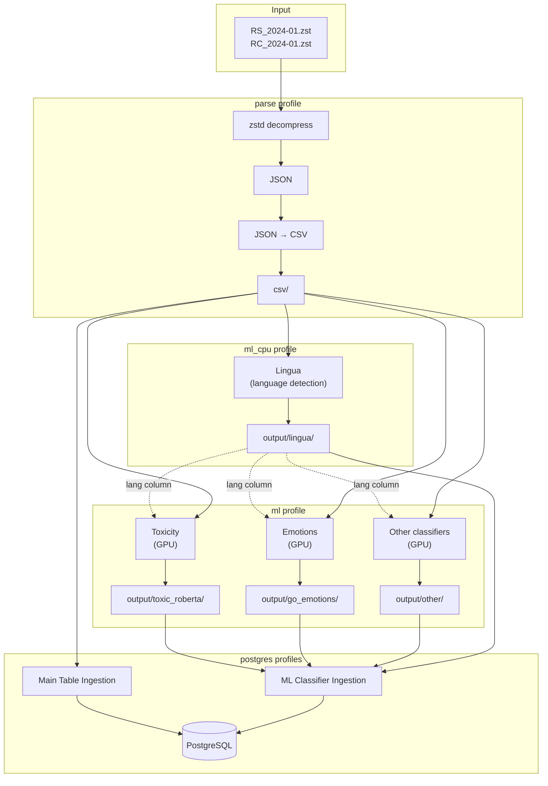
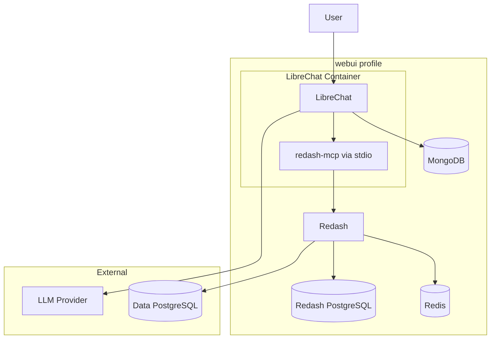

# reddit-data-tools

A unified monorepo for large-scale processing, classification, and database ingestion of [Reddit data dumps](https://github.com/ArthurHeitmann/arctic_shift). Combines and extends the functionality of [classifier_shift](https://github.com/joaopn/classifier_shift) and [db_shift](https://github.com/joaopn/db_shift).

## Table of Contents

- [Overview](#overview)
- [Architecture](#architecture)
- [Requirements](#requirements)
- [Quick Start](#quick-start)
- [Docker Profiles](#docker-profiles)
- [WebUI (LLM Chatbot Interface)](#webui-llm-chatbot-interface)
- [Configuration](#configuration)
  - [Environment Variables](#environment-variables)
  - [Config Directory Structure](#config-directory-structure)
  - [Pipeline Configuration](#pipeline-configuration)
  - [Classifier Configuration](#classifier-configuration)
  - [Database Configuration](#database-configuration)
- [Classifiers](#classifiers)
  - [Lingua (CPU)](#lingua-cpu)
  - [Transformer Classifiers (GPU)](#transformer-classifiers-gpu)
- [Adding Custom Classifiers](#adding-custom-classifiers)
- [Input / Output](#input--output)
- [Resume Capability](#resume-capability)
- [Removal Detection](#removal-detection)
- [Storage Requirements](#storage-requirements)
- [FAQ](#faq)
- [Troubleshooting](#troubleshooting)
- [License](#license)

## Overview

**reddit-data-tools** is a Docker-based monorepo that provides a complete pipeline for working with Reddit monthly data dumps:

- **Automatic detection and decompression** of `.zst` dump files
- **Parsing** JSON to clean CSVs with configurable field extraction
- **Modular classification** - CPU-based (Lingua) and GPU-based (transformers)
- **Multi-GPU parallelization** for transformer classifiers
- **Language filtering** - optionally classify only specific languages
- **PostgreSQL ingestion** with optimized indexing and duplicate handling
- **Removal detection** from various content removal fields
- **Config-based** addition of new classifiers and database backends

## Architecture



## Requirements

- [Docker Compose](https://docs.docker.com/compose/)
- Sufficient storage (see [Storage Requirements](#storage-requirements))
- **For GPU classification**: [NVIDIA Container Toolkit](https://docs.nvidia.com/datacenter/cloud-native/container-toolkit/install-guide.html)

**Recommended for optimal performance:**
- Flash-based storage (NVMe SSDs strongly recommended)
- High core count CPU (8+)
- 64GB+ RAM
- NVIDIA GPU with 8GB+ VRAM (for `ml` profile)

## Quick Start

### 1. Get monthly data dumps

Download the Reddit data dumps from [arctic_shift](https://github.com/ArthurHeitmann/arctic_shift/blob/master/download_links.md). Place files in `data/dumps/`:

```bash
data/dumps/
├── RS_2024-01.zst    # Submissions
└── RC_2024-01.zst    # Comments
```

The pipeline also supports the torrent directory structure (`submissions/RS_YYYY-MM.zst` and `comments/RC_YYYY-MM.zst`).

### 2. Configure

Confirm or edit paths in the `.env` file. 

```bash
# Paths
DUMPS_PATH=./data/dumps         # .zst compressed dumps
EXTRACTED_PATH=./data/extracted # extracted ndjson location
CSV_PATH=./data/csv             # parsed CSV files location
OUTPUT_PATH=./data/output       # ml classifier location
PGDATA_PATH=./data/database     # database location

# Database (for postgres profiles)
DB_NAME=datasets      # database name
DB_SCHEMA=reddit      # database schema for the tables
POSTGRES_PORT=5432    # PostgreSQL port to connect to
```

There are *extensive* configuration options in `config/` (see [Configuration](#configuration)). Create a `user.yaml` file in any profile directory to override defaults (check `user.yaml.example` for templates).

### 3. Run

```bash
# Parse only (extract and convert to CSV)
docker compose --profile parse up

# CPU classification (Lingua language detection)
docker compose --profile ml_cpu up

# GPU classification (optional, requires NVIDIA GPU)
docker compose --profile ml up

# Database workflow: start postgres first, then run ingestion pipelines
docker compose --profile postgres up -d
docker compose --profile postgres_ingest up

# Ingests optional GPU-classified files if available
docker compose --profile postgres_ml up
```

This runs everything and spawns the database. To shut it down

```bash
# Shuts down database
docker compose --profile postgres down
```

> **Long classification runtime:** Due to sheer size the machine learning classification can take very long to run, especially the transformers classifiers (~1 month on a cluster with 4X L40S GPUs per classifier for the entire dumps). It is recommended to obtain the preprocessed files from somewhere else. You can estimate the runtime on your system by checking here: https://github.com/joaopn/gpu_benchmark_goemotions


## Docker Profiles

| Profile | Description | Dockerfile | Dependencies |
|---------|-------------|------------|--------------|
| `parse` | Extract `.zst` files, parse JSON to CSV | `Dockerfile` | None |
| `ml_cpu` | Run Lingua language detection (CPU-only) | `Dockerfile` | Requires parsed CSVs |
| `ml` | Run transformer classifiers (GPU) | `Dockerfile.gpu` | Requires parsed CSVs, optionally Lingua output |
| `postgres` | Run PostgreSQL database server | `postgres:18` | None |
| `postgres_ingest` | Ingest CSVs into PostgreSQL main tables | `Dockerfile` | Requires postgres running, parsed CSVs |
| `postgres_ml` | Ingest ML classifier outputs into PostgreSQL | `Dockerfile` | Requires postgres running, ML outputs |
| `webui` | LLM chatbot interface (LibreChat + Redash) | Multiple images | Requires postgres running |

**Note:** GPU profile requires [NVIDIA Container Toolkit](https://docs.nvidia.com/datacenter/cloud-native/container-toolkit/install-guide.html).

## WebUI (LLM Chatbot Interface)

The `webui` profile provides a no-code interface for querying the Reddit database using natural language. It bundles:

- **[LibreChat](https://github.com/danny-avila/LibreChat)**: Chat UI and LLM orchestrator
- **[Redash](https://redash.io/)**: SQL engine, job queue, and dashboard for query execution
- **[redash-mcp](https://github.com/suthio/redash-mcp)**: MCP server bridging the LLM to Redash

### How It Works

1. User asks a question in LibreChat (e.g., "Show me trending posts in r/datascience")
2. LLM receives the question and uses the redash-mcp tool to understand the database schema
3. LLM constructs an optimized SQL query following best practices for TB-scale data
4. Query is submitted to Redash, which returns a Job ID and result URL
5. User receives a link to track progress and download CSV results in Redash

### Architecture



**Note:** The redash-mcp server runs **inside** the LibreChat container as a child process (stdio transport). LibreChat spawns `npx @suthio/redash-mcp` when the MCP tools are needed.

### LLM Provider Configuration

The webui profile does **NOT** bundle an LLM. You must provide either:

- **Local**: OpenAI-compatible server (LM Studio, Ollama, vLLM, etc.)
- **Remote**: OpenAI, Anthropic, or OpenRouter API

Configure in `config/webui/pipeline.yaml` or `config/webui/user.yaml`:

```yaml
llm:
  provider: "local"        # Options: local, openai, anthropic, openrouter
  model: "qwen2.5-coder"   # Model name (REQUIRED)
  port: 1234               # For local provider (1234=LM Studio, 11434=Ollama)
  api_key: null            # Required for remote providers
```

### Quick Start

**1. Ensure postgres profile is running:**

```bash
docker compose --profile postgres up -d
```

**2. Run the setup orchestrator:**

```bash
docker compose run --rm webui-setup
```

This generates configuration files and prints detailed setup instructions.

**3. Copy secrets to your `.env` file:**

```bash
cat data/webui/secrets.env >> .env
```

**4. Create the read-only database user:**

```bash
# Connect to your data PostgreSQL
psql -h localhost -U postgres -d datasets -f data/webui/create_readonly_user.sql
```

**5. Initialize Redash database (first time only):**

```bash
docker compose run --rm redash-server create_db
```

**6. Start the webui stack:**

```bash
docker compose --profile webui up -d
```

**7. Configure Redash:**

1. Open Redash at `http://localhost:5000`
2. Create an admin user (first time)
3. Go to **Settings → API Keys → Create** and copy the key
4. Add to `.env`: `REDASH_API_KEY=<your-key>`
5. Go to **Settings → Data Sources → New Data Source**
6. Choose PostgreSQL with settings:
   - Host: `postgres`
   - Port: `5432`
   - Database: `datasets`
   - User: `redash_readonly`
   - Password: (from `data/webui/secrets.env`)

**8. Access the interfaces:**

- **LibreChat**: `http://localhost:3080`
- **Redash**: `http://localhost:5000`

### Read-Only Enforcement

For safety with TB-scale data, queries are restricted to read-only:

1. **Database Level**: Redash connects with a read-only PostgreSQL user
2. **System Prompt**: LLM is instructed to only generate SELECT queries
3. **Schema**: `redash_readonly` user has SELECT-only permissions

### WebUI Environment Variables

| Variable | Description | Default |
|----------|-------------|---------|
| `LIBRECHAT_PORT` | LibreChat web UI port | `3080` |
| `REDASH_PORT` | Redash web UI port | `5000` |
| `REDASH_WEB_WORKERS` | Redash web workers | `2` |
| `REDASH_QUERY_TIMEOUT` | Query timeout (seconds) | `300` |
| `REDASH_API_KEY` | Redash API key for MCP | *(required after setup)* |

### WebUI Configuration

```
config/webui/
├── pipeline.yaml          # LLM provider, ports, database settings
├── prompts.yaml           # System prompts for query guidance
├── librechat.yaml.template # LibreChat config template
└── user.yaml.example      # Override template
```

System prompts in `prompts.yaml` guide the LLM on:
- Database schema discovery
- Query optimization for TB-scale data (use indexes, avoid full scans)
- The "handoff" pattern (return Job ID + URL, don't wait)
- Read-only enforcement

## Configuration

### Environment Variables

| Variable | Description | Default |
|----------|-------------|---------|
| `DUMPS_PATH` | Directory containing `.zst` dump files | `./data/dumps` |
| `EXTRACTED_PATH` | Storage for decompressed JSON files | `./data/extracted` |
| `CSV_PATH` | Storage for parsed CSV files | `./data/csv` |
| `OUTPUT_PATH` | Storage for classifier output files | `./data/output` |
| `PGDATA_PATH` | PostgreSQL data directory | `./data/database` |
| `DB_NAME` | PostgreSQL database name | `datasets` |
| `DB_SCHEMA` | PostgreSQL schema name | `reddit` |
| `POSTGRES_PORT` | PostgreSQL port exposed to host | `5432` |
| `LIBRECHAT_PORT` | LibreChat web UI port (webui profile) | `3080` |
| `REDASH_PORT` | Redash web UI port (webui profile) | `5000` |

### Config Directory Structure

```
config/
├── shared/                        # Shared across all profiles
│   ├── reddit_field_list.yaml     # Field list for parsing/database
│   └── reddit_field_types.yaml    # Field type definitions
├── parse/
│   └── pipeline.yaml              # Parse-only settings
├── ml_cpu/
│   ├── pipeline.yaml              # CPU classifier settings
│   └── cpu_classifiers.yaml       # Lingua configuration
├── ml/
│   ├── pipeline.yaml              # GPU classifier settings
│   └── gpu_classifiers.yaml       # Transformer configurations
├── postgres/
│   ├── pipeline.yaml              # Main table ingestion settings
│   ├── postgresql.conf            # PostgreSQL tuning
│   └── pg_hba.conf                # PostgreSQL authentication
├── postgres_ml/
│   ├── pipeline.yaml              # ML classifier ingestion settings
│   └── services.yaml              # ML classifier definitions
└── webui/
    ├── pipeline.yaml              # LLM provider, ports, database settings
    ├── prompts.yaml               # System prompts for query guidance
    └── librechat.yaml.template    # LibreChat config template
```

#### User Configuration Overrides

Each profile supports a `user.yaml` file that overrides base settings without modifying tracked files. To customize a profile:

1. Copy `user.yaml.example` to `user.yaml` in the profile directory
2. Uncomment and modify the settings you want to change
3. The pipeline will automatically merge your overrides with the base configuration

**Important:** User overrides are scoped by config filename. Each top-level key in `user.yaml` corresponds to a config file (without the `.yaml` extension):

```yaml
# Example ml/user.yaml
pipeline:              # Overrides settings from pipeline.yaml
  processing:
    parse_workers: 16

gpu_classifiers:       # Overrides settings from gpu_classifiers.yaml
  batch_size: 1000000
```

### Pipeline Configuration

Each profile has its own `pipeline.yaml`. Common settings:

```yaml
processing:
  data_types:          # What to process
    - submissions
    - comments
  parallel_mode: true  # Process files in parallel
  parse_workers: 4     # Parallel workers for CSV parsing
  cleanup_temp: false   # Delete temp files after processing
  watch_interval: 0    # 0 = run once, >0 = check every N minutes
```

### Classifier Configuration

#### config/ml_cpu/cpu_classifiers.yaml

```yaml
lingua:
  suffix: "_lingua"
  low_accuracy: false     # false = higher accuracy, slower
  workers: 16             # Lingua's internal parallelism
  file_workers: 1         # Files to process in parallel
  batch_size: 2000000     # Rows per batch
  languages:              # Languages to detect
    - english
    - german
    - spanish
    # ... (40 languages supported)
```

#### config/ml/gpu_classifiers.yaml

```yaml
# Global settings
text_columns:
  submissions: [title, selftext]
  comments: [body]
gpu_ids: [0]              # GPUs to use
file_workers: 1           # Files in parallel
batch_size: 2000000       # Rows per batch
use_lingua: true          # Use Lingua output for language filtering
fields:                   # Columns to keep from input CSV (default: all)
  - dataset
  - author
  - subreddit

# Classifier definitions
toxic_roberta:
  suffix: "_toxicity_en"
  type: onnx_fp16
  model: "joaopn/unbiased-toxic-roberta-onnx-fp16"
  activation: sigmoid
  supported_languages: [en]
  classifier_batch_size: 8
  max_length: 512

go_emotions:
  suffix: "_emotions"
  type: onnx_fp16
  model: "joaopn/roberta-base-go_emotions-onnx-fp16"
  activation: sigmoid
  supported_languages: [en]
  classifier_batch_size: 8
  max_length: 512
```

### Database Configuration

#### config/postgres/pipeline.yaml

```yaml
database:
  name: reddit_data
  host: postgres
  port: 5432
  user: postgres
  schema: reddit

processing:
  check_duplicates: true    # Handle duplicate IDs (upsert)
  create_indexes: true      # Create indexes after ingestion
  parallel_ingestion: true  # Ingest submissions/comments concurrently
  fast_initial_load: false  # Use optimized bulk load for initial ingestion (see below)

indexes:
  submissions: [author, subreddit, domain, created_utc]
  comments: [author, subreddit, link_id, created_utc]
```

#### Fast Initial Load

When `fast_initial_load: true`, the pipeline uses an optimized bulk ingestion strategy for initial table creation:

1. Creates UNLOGGED table (no WAL, faster writes)
2. Blind COPY of all CSV files (no duplicate checking during load)
3. In-place deduplication using ROW_NUMBER() window function
4. Adds PRIMARY KEY constraint
5. VACUUM FREEZE to update visibility maps
6. Converts table to LOGGED (triggers WAL flush for durability)

**Performance**: Significantly faster than the standard ON CONFLICT approach for large initial loads (billions of rows).

**Limitations**:
- **Recovery not possible**: If the process fails mid-load (crash, kill, OOM), the database will be in an inconsistent state and must be fully recreated. Drop the tables and restart from scratch.
- **Only for initial load**: Once tables exist, subsequent ingestions always use the standard ON CONFLICT path regardless of this setting.
- **Server tuning recommended**: For optimal performance, pre-configure `max_wal_size` (20GB+) and `checkpoint_timeout` (30min+) in `postgresql.conf` before running large bulk loads.

#### config/postgres_ml/pipeline.yaml

```yaml
processing:
  use_foreign_key: true     # Add FK constraint to main tables (default: true)
                            # Set false for independent ingestion without main table
  fast_initial_load: false  # Use optimized bulk load for initial classifier ingestion
```

The `fast_initial_load` option also works for ML classifier tables (`postgres_ml` profile). The process is similar to main tables but includes adding the FOREIGN KEY constraint after deduplication:

1. Creates UNLOGGED table (no PK, no FK)
2. Blind COPY of all classifier CSV files
3. In-place deduplication
4. Adds PRIMARY KEY constraint
5. Adds FOREIGN KEY constraint (validates all ids exist in main table)
6. VACUUM FREEZE
7. Converts to LOGGED

The same limitations apply: if the process fails mid-load, tables must be dropped and recreated.

#### PostgreSQL Tuning

For optimal performance, use [PGTune](https://pgtune.leopard.in.ua/) to generate settings:
- **DB Type**: Data Warehouse
- **Data Storage**: SSD

Append the output to `config/postgres/postgresql.conf`.

## Classifiers

### Lingua (CPU)

[Lingua](https://github.com/pemistahl/lingua-py) provides fast language detection with Rust/Rayon parallelism.

| Output Column | Description |
|---------------|-------------|
| `lang` | ISO 639-1 code (e.g., `en`, `de`) |
| `lang_prob` | Confidence score (0.0 - 1.0) |
| `lang2` | Second most likely language |
| `lang2_prob` | Confidence for `lang2` |

**Text Filtering:** Texts are classified if they meet minimum thresholds (3+ words, or 2 words with ≥10 chars, or 1 word with ≥5 chars).

### Transformer Classifiers (GPU)

GPU-based classifiers using HuggingFace models with ONNX or PyTorch backends.

| Classifier | Model | Output |
|------------|-------|--------|
| `toxic_roberta` | `joaopn/unbiased-toxic-roberta-onnx-fp16` | Toxicity labels (multi-label) |
| `go_emotions` | `joaopn/roberta-base-go_emotions-onnx-fp16` | Emotion labels |

#### Transformer Options

| Option | Description | Default |
|--------|-------------|---------|
| `type` | `onnx_fp16`, `onnx`, or `pytorch` | `onnx_fp16` |
| `model` | HuggingFace model ID | *(required)* |
| `activation` | `sigmoid` (multi-label) or `softmax` | `softmax` |
| `supported_languages` | Filter by lang column | *(all)* |
| `fields` | Columns to keep from input CSV | `[dataset, author, subreddit]` |
| `classifier_batch_size` | Batch size per GPU | `32` |
| `max_length` | Max tokens | `512` |
| `chunking_strategy` | `truncate` or `chunk` | `truncate` |
| `stride` | Overlap between chunks | `64` |
| `top_k` | Top-k chunks to average | `2` |

## Adding Custom Classifiers

### Config-only (no code)

Add to `config/ml/gpu_classifiers.yaml`:

```yaml
my_classifier:
  suffix: "_my_classifier"
  type: onnx_fp16
  model: "org/model-name"
  file_name: "model.onnx"
  activation: sigmoid
  supported_languages: [en]
  classifier_batch_size: 32
  max_length: 512
```

Add to `config/ml/pipeline.yaml`:

```yaml
gpu_classifiers:
  - my_classifier
```

### Custom Python

Create `reddit_data_tools/classifiers/my_classifier.py`:

```python
from .base import register_classifier

@register_classifier('my_classifier')
class MyClassifier:
    def __init__(self, name, classifier_config, global_config):
        ...
    
    def process_csv(self, input_csv, output_csv, data_type, config):
        ...
```

## Input / Output

### Input

```
DUMPS_PATH/
├── RS_2024-01.zst
└── RC_2024-01.zst
```

### Output

```
CSV_PATH/
├── submissions/RS_2024-01.csv
└── comments/RC_2024-01.csv

OUTPUT_PATH/
├── lingua/
│   ├── submissions/RS_2024-01_lingua.csv
│   └── comments/RC_2024-01_lingua.csv
├── toxic_roberta/
│   └── comments/RC_2024-01_toxicity_en.csv
└── go_emotions/
    └── comments/RC_2024-01_emotions.csv

PGDATA_PATH/
└── pipeline_state.json
```

## Resume Capability

Each component tracks progress independently:

- **Parse**: Skips already extracted/parsed files
- **Classifiers**: Check if output files exist before processing
- **Database**: Tracks ingested datasets in state file

To reprocess specific outputs:

```bash
# Reprocess toxicity only
rm -rf data/output/toxic_roberta/

# Reprocess all classifiers
rm -rf data/output/

# Full reprocess
rm -rf data/output/ data/csv/ data/extracted/
```

## Removal Detection

The pipeline automatically detects deleted and removed content using a waterfall algorithm. The `removal_type` field contains canonical values:

| Value | Description |
|-------|-------------|
| `deleted` | User deleted their own content |
| `moderator` | Removed by subreddit moderator |
| `reddit` | Removed by Reddit admin/spam filter |
| `automod_filtered` | Removed by AutoModerator |
| `content_takedown` | Legal/DMCA takedown |
| `''` (empty) | Not removed |

The algorithm checks multiple fields in priority order: `_meta.removal_type` → `removed_by_category` → `spam`/`removed` flags → `banned_by` → text content → author.

## Storage Requirements

Storage needs depend on pipeline mode and selected fields:

| Component | Sequential Mode | Parallel Mode |
|-----------|-----------------|---------------|
| Intermediate files | ~4TB | ~51TB |
| With ZFS/BTRFS compression | ~4TB | ~9TB |
| PostgreSQL database | ~10TB (uncompressed) | ~6TB (LZ4) |

**Pipeline modes:**
- **Sequential** (`parallel_mode: false`): Process one file at a time, lower disk usage
- **Parallel** (`parallel_mode: true`): Extract all → Parse all → Ingest all, much faster

## FAQ

### Why no table partitioning?

This project targets large-scale, Reddit-wide analysis. For queries not limited to a few months, partitioning would split indexes into 200+ partitions, hurting query performance. It would also interfere with ID deduplication during ingestion.

### Can I run classifiers without the database?

Yes! Use `--profile ml_cpu` or `--profile ml` independently. The database profile is optional.

## Troubleshooting

### Pipeline Fails

```bash
# Check logs
docker compose logs parse
docker compose logs ml_cpu
docker compose logs postgres-ingest
docker compose logs postgres-ml

# Check state
cat data/database/pipeline_state.json
```

### PostgreSQL Connection Issues

```bash
docker compose ps
docker compose logs postgres
```

### Out of Disk Space

- Ensure `cleanup_temp: true` in pipeline.yaml
- Check temp directories for leftover files
- Consider sequential mode to reduce intermediate storage

### GPU Not Detected

Verify NVIDIA Container Toolkit is installed:
```bash
docker run --rm --gpus all nvidia/cuda:12.1.1-base-ubuntu22.04 nvidia-smi
```

### WebUI Issues

```bash
# Check all webui services
docker compose --profile webui ps
docker compose --profile webui logs

# Check specific services
docker compose logs librechat
docker compose logs redash-server
docker compose logs redash-worker

# Verify Redash API key is set
grep REDASH_API_KEY .env

# Regenerate configuration
docker compose run --rm webui-setup
```

**Common issues:**

- **"REDASH_API_KEY not set"**: Create an API key in Redash UI and add to `.env`
- **LLM not responding**: Check your LLM provider is running and accessible from Docker (use `host.docker.internal` for local providers)
- **Queries timing out**: Increase `REDASH_QUERY_TIMEOUT` in `.env`

## License

See LICENSE file.
