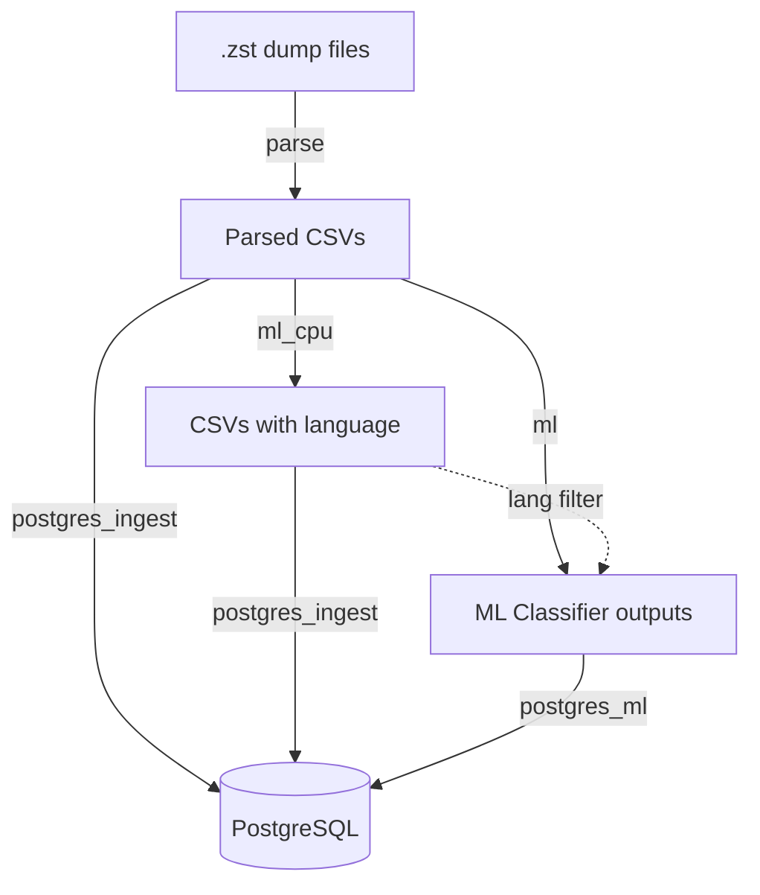

# Social Data Bridge

A Docker-based toolkit for large-scale processing, classification, and database ingestion of social media data dumps. Designed for the [Reddit data dumps](https://github.com/ArthurHeitmann/arctic_shift), with support for multiple platforms through a configurable architecture.

## Overview

**Social Data Bridge** is a Docker-based monorepo that provides a complete pipeline for working with large-scale social media data dumps:

- **Multi-platform support** - Reddit (with specialized features) or generic JSON/CSV processing
- **Automatic detection and decompression** of `.zst` dump files
- **Parsing** JSON to clean CSVs with configurable field extraction
- **Modular classification** - CPU-based (Lingua) and GPU-based (transformers)
- **Multi-GPU parallelization** for transformer classifiers
- **Language filtering** - optionally classify only specific languages
- **PostgreSQL ingestion** with finetuned settings and duplicate handling
- **Config-based** addition of new classifiers, platforms, and database backends

## Architecture



## Requirements

- [Docker Compose](https://docs.docker.com/compose/)
- Sufficient storage (see [Storage Requirements](#storage-requirements))
- **For GPU classification**: [NVIDIA Container Toolkit](https://docs.nvidia.com/datacenter/cloud-native/container-toolkit/install-guide.html)

**Recommended for optimal performance:**
- Flash-based storage (NVMe SSDs strongly recommended)
- High core count CPU (8+)
- 64GB+ RAM
- NVIDIA GPU with 8GB+ VRAM (for `ml` profile)

## Quick Start

### Reddit Data (Default)

#### 1. Get monthly data dumps

Download the Reddit data dumps from [arctic_shift](https://github.com/ArthurHeitmann/arctic_shift/blob/master/download_links.md) and place the torrent directory in `data/dumps/`:

```bash
data/dumps/
├── submissions/
│   ├── RS_2024-01.zst
│   └── RS_2024-02.zst
└── comments/
    ├── RC_2024-01.zst
    └── RC_2024-02.zst
```

#### 2. Configure paths

Confirm or edit paths in the `.env` file:

```bash
DUMPS_PATH=./data/dumps         # .zst compressed dumps
EXTRACTED_PATH=./data/extracted  # extracted ndjson location
CSV_PATH=./data/csv              # parsed CSV files location
OUTPUT_PATH=./data/output        # ml classifier location
PGDATA_PATH=./data/database      # database location

DB_NAME=datasets                 # database name
POSTGRES_PORT=5432               # PostgreSQL port
```

#### 3. Run

```bash
# Parse Reddit data to CSV
docker compose --profile parse up

# CPU language detection (Lingua)
docker compose --profile ml_cpu up

# GPU classifiers (optional, requires NVIDIA GPU)
docker compose --profile ml up

# Database workflow
docker compose --profile postgres up -d
docker compose --profile postgres_ingest up
docker compose --profile postgres_ml up
```

### Generic Platform Data

For processing arbitrary JSON/NDJSON data from other sources:

```bash
PLATFORM=generic docker compose --profile parse up
```

The generic platform requires configuration of field lists, field types, and file patterns. See [Generic Platform Setup](docs/platforms/generic.md) for the full setup guide.

## Profiles

| Profile | Description | Input | Output |
|---------|-------------|-------|--------|
| `parse` | Decompress `.zst`, parse JSON to CSV | `.zst` dump files | `CSV_PATH/` |
| `ml_cpu` | Lingua language detection (CPU) | Parsed CSVs | `OUTPUT_PATH/lingua/` |
| `ml` | Transformer classifiers (GPU) | Parsed CSVs + Lingua output | `OUTPUT_PATH/{classifier}/` |
| `postgres` | PostgreSQL database server | - | - |
| `postgres_ingest` | Ingest CSVs into PostgreSQL | Parsed CSVs (or Lingua CSVs) | PostgreSQL tables |
| `postgres_ml` | Ingest ML outputs into PostgreSQL | Classifier output CSVs | PostgreSQL tables |

**Note:** GPU profile requires [NVIDIA Container Toolkit](https://docs.nvidia.com/datacenter/cloud-native/container-toolkit/install-guide.html).

For detailed configuration and algorithm documentation, see the per-profile docs:
- [Parse Profile](docs/profiles/parse.md)
- [Classification Profiles (ml_cpu / ml)](docs/profiles/classification.md)
- [Database Profiles (postgres / postgres_ingest / postgres_ml)](docs/profiles/database.md)

## Platform Support

| Platform | Description | Default |
|----------|-------------|---------|
| `reddit` | Specialized Reddit features: waterfall deletion detection, base-36 ID conversion, format compatibility | Yes |
| `generic` | Simple JSON-to-CSV for arbitrary data: dot-notation, array indexing, type enforcement | No |

- [Reddit Platform Reference](docs/platforms/reddit.md)
- [Generic Platform Setup](docs/platforms/generic.md)

## Extending

- **Add new platforms**: Create config files and an optional custom parser. See [Adding Platforms](docs/platforms/adding-platforms.md).
- **Add custom classifiers**: Config-only (add a HuggingFace model via YAML) or custom Python. See [Custom Classifiers](docs/guides/custom-classifiers.md).
- **Full configuration reference**: All environment variables, YAML files, and the user.yaml override system. See [Configuration](docs/configuration.md).

## Input / Output

### Input

```
DUMPS_PATH/
├── RS_2024-01.zst      # Reddit submissions
├── RC_2024-01.zst      # Reddit comments
└── data_2024-01.zst    # Generic platform data
```

### Output

```
CSV_PATH/
├── submissions/RS_2024-01.csv
└── comments/RC_2024-01.csv

OUTPUT_PATH/
├── lingua/
│   ├── submissions/RS_2024-01_lingua.csv
│   └── comments/RC_2024-01_lingua.csv
├── toxic_roberta/
│   └── comments/RC_2024-01_toxicity_en.csv
└── go_emotions/
    └── comments/RC_2024-01_emotions_en.csv
```

## Resume Capability

Each component tracks progress independently:

- **Parse**: Skips already extracted/parsed files
- **Classifiers**: Check if output files exist before processing
- **Database**: Tracks ingested datasets in state file

To reprocess specific outputs:

```bash
# Reprocess a specific classifier
rm -rf data/output/toxic_roberta/

# Reprocess all classifiers
rm -rf data/output/

# Full reprocess
rm -rf data/output/ data/csv/ data/extracted/
```

## Storage Requirements

Storage needs depend on pipeline mode and selected fields (estimates for full Reddit dumps):

| Component | Sequential Mode | Parallel Mode |
|-----------|-----------------|---------------|
| Intermediate files | ~4TB | ~51TB |
| With ZFS/BTRFS compression | ~4TB | ~9TB |
| PostgreSQL database | ~10TB (uncompressed) | ~6TB (LZ4) |

See [Database Profiles](docs/profiles/database.md#storage-requirements) for details on pipeline modes.

## FAQ

### Why no table partitioning?

This project targets large-scale, Reddit-wide analysis. For queries not limited to a few months, partitioning would split indexes into 200+ partitions, hurting query performance. It would also interfere with ID deduplication during ingestion.

### Can I run classifiers without the database?

Yes! Use `--profile ml_cpu` or `--profile ml` independently. The database profile is optional.

### Can I use this for non-Reddit data?

Yes! Use `PLATFORM=generic` to process arbitrary JSON/NDJSON data. See the [Generic Platform](docs/platforms/generic.md) setup guide.

### How do I add support for a new platform?

See [Adding New Platforms](docs/platforms/adding-platforms.md). Create configuration files in `config/platforms/{platform}/` and optionally a custom parser.

## Troubleshooting

### Pipeline Fails

```bash
# Check logs
docker compose logs parse
docker compose logs ml_cpu
docker compose logs postgres-ingest
docker compose logs postgres-ml
```

### PostgreSQL Connection Issues

```bash
docker compose ps
docker compose logs postgres
```

### Out of Disk Space

- Ensure `cleanup_temp: true` in pipeline.yaml
- Check temp directories for leftover files
- Consider sequential mode to reduce intermediate storage

### GPU Not Detected

Verify NVIDIA Container Toolkit is installed:
```bash
docker run --rm --gpus all nvidia/cuda:12.1.1-base-ubuntu22.04 nvidia-smi
```

## AI disclaimer

Most of the orchestration and dockerization glue code was written by LLMs, under human planning and code review. The algorithms and ingestion structure are a merge of a number of private repos developed over a period of almost 4 years.

## License

See LICENSE file.
